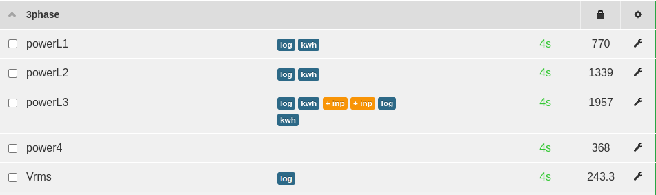
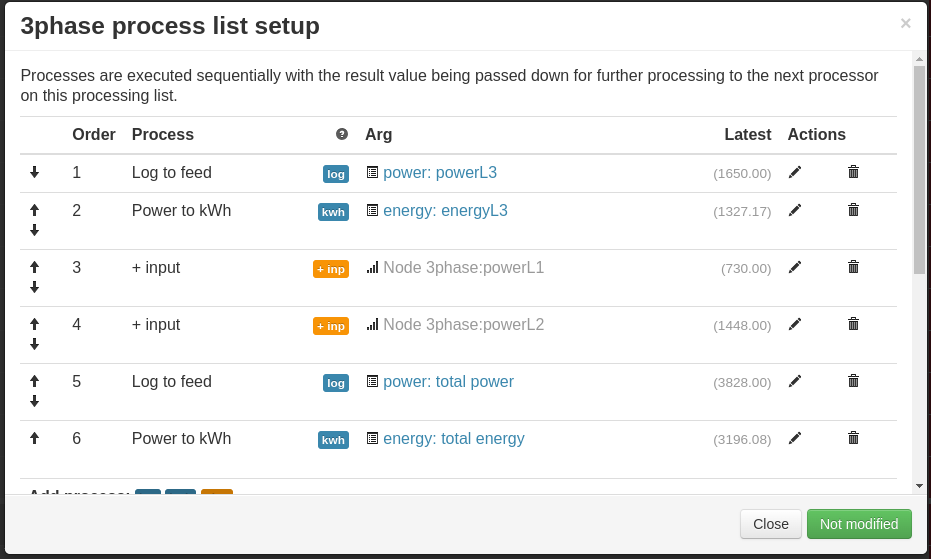

# emonTx 3phase

An emonTx3 can be used for 3-phase monitoring using the [three-phase firmware](https://github.com/openenergymonitor/emontx-3phase).

Designed for use on a 3-phase, 4-wire system. The firmware provides continuous monitoring of voltage of one phase and the currents in all three phases, thereby allowing a good estimate of real power to be calculated. The physical quantities are measured continuously, the average values are calculated and transmitted at user-defined intervals.

Pulse counting and temperature monitoring using a single DS18B20 sensor is supported.

Data is transmitted to the emonPi or emonBase via the low power 433MHz radio as standard, or alternatively using the [ESP8266 WiFi adapter](esp8266.md).

## 1. Installation 

**Before starting installation it's important to identify the phases.**

- Ideally plug the AC voltage adapter into L1 this will allow straightforward connection of CTs as follows CT1=L1, CT2=L2 and CT3=L3. 

- If it's not possible to plug the AC voltage adapter into L1 e.g all the accessible plug sockets are on a different phase then the connection of CTs must be adjusted e.g If AC voltage adapter is plugged into L2 then the CTs must be connected as follows CT1=L2, CT2=L3 and CT3=L1

For a detailed and technical explanation of the 3-phase firmware, see the [emonTx three-phase technical user guide](https://github.com/openenergymonitor/emontx-3phase/blob/master/emontx-3-phase-userguide.pdf) and the [3-phase emonTx firmware repository](https://github.com/openenergymonitor/emontx-3phase). 

```{note}
The emonTx3 3-phase firmware default nodeid is node 11. If installing multiple units, moving the bottom DIP switch (D8) to the left will change the node ID to 12. This can alternatively be done via serial configuration, see [Adding to an existing install](add.md)
```

## 2. Emoncms Input processing

Setup the input processing as follows, 



Use the `+ Input` input process to add the phase power inputs together to create a feed for the total power e.g



