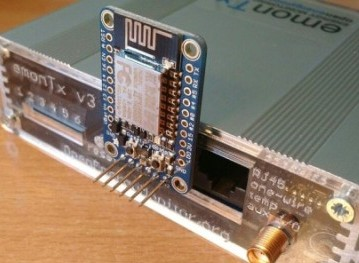
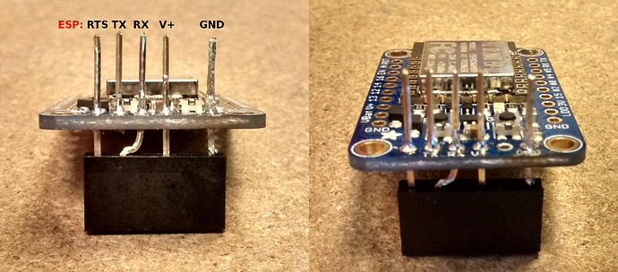
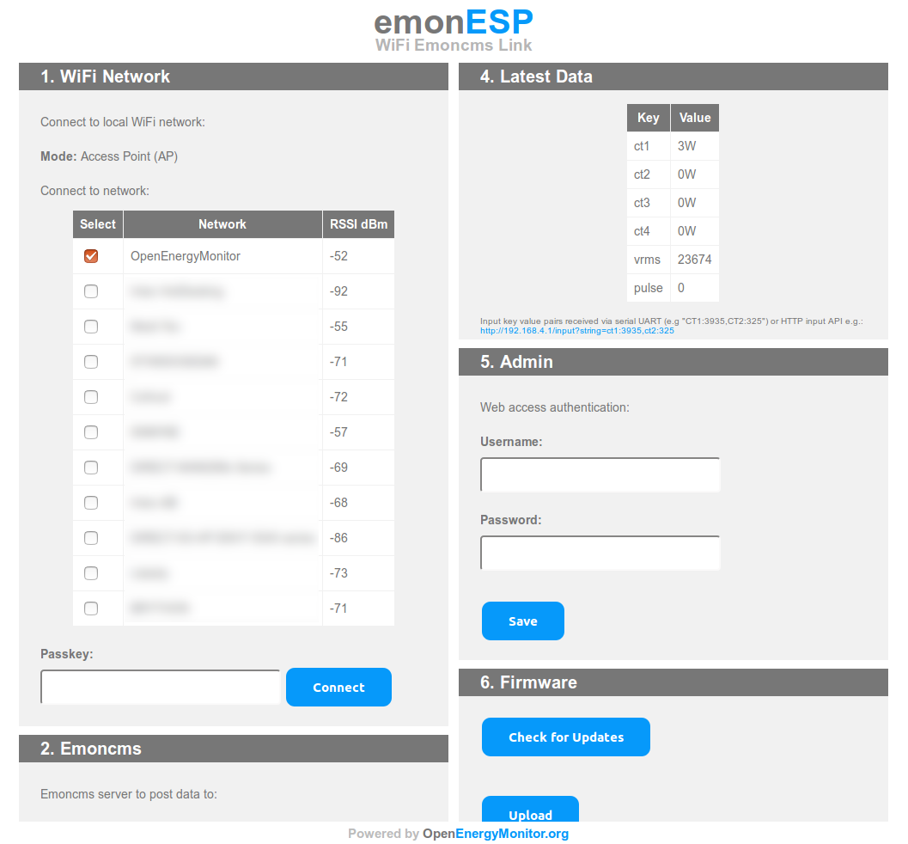
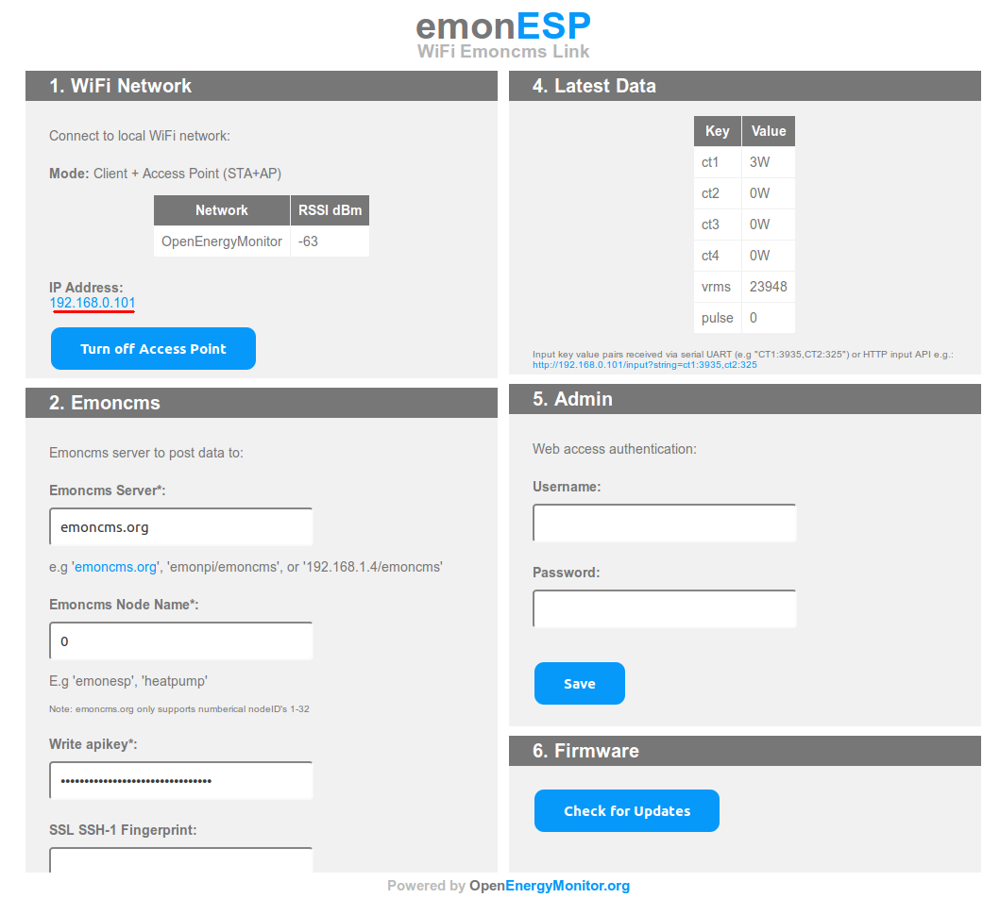
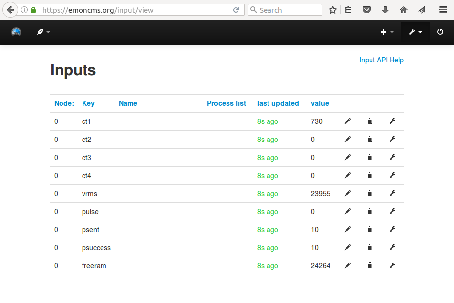

# Using the emonTx v3 with the ESP8266 Huzzah WIFI module

This is a guide on how to use the Adafruit ESP8266 Huzzah WiFi module with an [emonTx v3](../emontx3/technical.md) to make a simple WiFi enabled energy monitor that can post directly to [emoncms.org](https://emoncms.org) or any other Emoncms installation local or remote.

For applications that only require basic posting of data from one emonTx to a remote server such as Emoncms.org an emonTx with this WiFi module provides a lower cost route than an emonBase or emonPi base-station installation.

An emonBase or emonPi is recommended for more complex applications where local storage is desirable and/or an installation with multiple sensors and control nodes. An emonPi/emonBase system allows for much greater expandability and customisation.

## To set up an emonTx v3 + ESP8266 Wifi energy monitor you will need:

- **[An emonTx + WiFi adapter bundle is now available to buy in the shop.](https://shop.openenergymonitor.com/emontx-wifi-adapter-1/)** 

Alternatively, you will need:

- **[emonTx V3](../emontx3/overview.md):** + CT, AC-AC adapter, temperature and pulse sensors as required by your application. 
*To use ESP8266 with emonTx three-phase firmware, the EmonESP baud rate needs to be set to 9600*

- **5V USB DC Power supply for the emonTx:** The AC-AC Voltage adapter that can power the emonTx in normal operation does not deliver enough power to run the ESP8266 Huzzah WiFi module and so an additional 5V USB Power supply is required. Battery operation is not possible when using ESP8266.

- **ESP8266 Huzzah WiFi module with a 6 way stackable header running [EmonESP](https://github.com/openenergymonitor/emonesp):** For a DIY approach see the original forum post [here](https://community.openenergymonitor.org/t/using-the-emontx-v3-with-the-esp8266-huzzah-wifi-module/795).

## ESP8266 Huzzah WIFI module with a 6 way stackable header:

Alternatively, 6 way ribbon cable with the RX/TX line swapped could be used, and may be a bit easier to put together.

N.B. You should connect ONLY the RX pins, and leave the Tx pins not connected, as the pictures above show.

## Setup procedure

1) Plug the ESP8266 Huzzah WIFI module into the emonTx as shown in the first picture above.

2) Connect any CT sensors, AC-AC adapter for voltage sensing and other sensors as required and plug in USB Power to the USB mini socket on the emonTx.

3) Remove (open) jumper JP2 on the emonTx PCB, then connect both the 5V DC USB power supply and the AC-AC adapter simultaneously, to ensure that the emonTx starts up detecting the AC-AC adapter and that enough power is delivered to the ESP8266 Huzzah WiFi module for start-up.

**Note:** It's important to remove/open jumper JP2 separates the AC and DC power supplies to ensure the emonTx is powered via DC and the AC is only used to provide an AC voltage reference.

4) The ESP8266 WiFi module will now create a WiFi access point for configuration. Using your laptop or phone, scan for WIFI networks, you should see a network SSID that looks something like:

    emonESP_1679732

5) After successful connection, navigate to IP address 192.168.4.1 to access the configuration page:

6) Select the WiFi network that you wish to connect to, enter passkey and click 'Connect'. Wait about 30s for the module to connect. Once connected the module will show its IP-address in the interface (underlined in red in the screenshot).

7) Click on the IP address to change your browser to the new location. Re-connect to your home WiFi network. Refresh the page to load the emonESP configuration page across your home LAN WiFi rather than the access point.

8) If you wish to post data to Emoncms.org, enter your Emoncms.org write apikey found on your Emoncms.org account page.

9) Click save, after around 10-20 seconds the interface should report that the successful packets have been sent to emoncms.org. You can now check the inputs page on your emoncms.org account, which should looks like this:

10) Configure Emoncms.org as normal, see emoncms documentation section of guide.

## EmonESP

The ESP8266 needs to run EmonESP firmware. The Huzzah modules sold via the shop are pre-loaded with EmonESP. For more info about EmonESP and to check for updates see [EmonESP Github](https://github.com/openenergymonitor/emonesp).

## MQTT

The emonESP firmware also supports publishing data to an MQTT broker. To use MQTT see the MQTT section on the EmonESP configuration page. You can enter a hostname, username, password and base topic to configure the module to post to an MQTT broker of your choice.

If you have an emonBase or emonPi on your local network the default settings are:

**hostname:** emonpi 
**username:** emonpi 
**password:** emonpimqtt2016 
**base topic:** emon/emontx 

*Note: on some networks that don't support hostname lookup you will need to use the IP address of the emonPi as the hostname. Also some networks report local hostname with the .local or .lan extension e.g. http://emonpi.local*

See [emonPi technical overview](../emonpi/technical.md) and [MQTT](../emoncms/mqtt.md) User Guide pages for more info.
