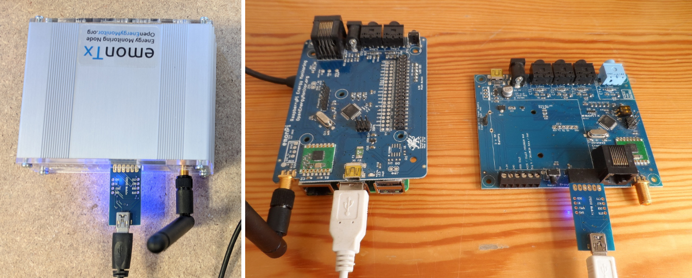

# Firmware

The emonTx3 firmware is based on Arduino. Alternative or customised firmware sketches can be uploaded using Arduino IDE or PlatformIO and a USB to UART cable.

## Available Firmware

### [emonTx34_CM](https://github.com/openenergymonitor/emontx3/tree/master/firmware/emonTx34/emonTx34_CM): continuous sampling firmware

This firmware provides higher accuracy continuous monitoring. Continuous monitoring means that the power readings are representative of the full 10s period that they represent rather than a short snapshot. This firmware was pre-loaded as standard since 2019, unless battery operation was selected.

**New:** Support for three different radio formats is available: JeeLib Classic, JeeLib Native and **LowPowerLabs**.

### [emonTx34_DS_jeelib_classic](https://github.com/openenergymonitor/emontx3/tree/master/firmware/emonTx34/emonTx34_DS_jeelib_classic): discrete sampling firmware

The original emonTx firmware, this performs power measurement in short discreet snapshots ~300ms long per CT channel at 50Hz per 10s period. This makes it possible for the emonTx to go to sleep inbetween readings enabling battery powered operation but is less accurate.

**Indicator LED:** Illuminates solid for a 10 seconds on first power up, then flashes multiple times to indicate an AC-AC waveform has been detected (if powering via AC-AC adapter). Flashes once every 10s to indicate sampling and RF transmission interval.

### [emonTx_3Phase_PLL](https://github.com/openenergymonitor/emontx3/tree/master/firmware/emonTx34/emonTx_3Phase_PLL): 3-phase continuous sampling firmware

This firmware is intended for use on a 3-phase, 4-wire system and implements continuous monitoring as above. Because the voltage of only one phase can be measured, the firmware must assume that the voltages of the other two phases are the same. This will, in most cases, not be true, therefore the powers calculated and recorded will be inaccurate. However, this error should normally be limited to a few percent.

- [Learn: Introduction to three-phase](https://learn.openenergymonitor.org/electricity-monitoring/ac-power-theory/3-phase-power)
- [Full 3-phase Firmware User Guide](https://github.com/openenergymonitor/emontx3/blob/master/firmware/emonTx34/emonTx_3Phase_PLL/emonTx_3Phase_PLL_User_Doc.pdf)

**New:** Support for three different radio formats is available: JeeLib Classic, JeeLib Native and **LowPowerLabs**.

## Updating firmware using an emonPi/emonBase

The easiest way of updating the emonTx3 firmware is to connect it to an emonPi or emonBase with a USB to UART cable and then use the firmware upload tool available at `Setup > Admin > Update > Firmware`.

The example images below show the earlier [Wicked Device / OpenEnergyMonitor Programmer](../electricity-monitoring/programmers/wicked-device.md). The programmer is the small board that plugs in to the emonTx3 on the 6-pin UART header. The [newer programmer](../electricity-monitoring/programmers/ftdi-programmer.md) currently available in the shop needs to be orientated the other way around. **Make sure that GND on the programmer matches up with GND on the emonTx3 board.**

Refresh the update page after connecting the USB cable. You should now see port ttyUSB0 appear in the ‘Select port` list.

Select port: `ttyUSB0`, Hardware: `emonTx`, Radio format: `RFM69 JeeLib Classic`, Firmware: As required, see above.

Click `Update Firmware` to upload the firmware.

## How to compile and upload firmware

### PlatformIO Command Line

PlatformIO works great from the command line. See the excellent [PlatformIO Quick Start Guide](https://docs.platformio.org/en/latest/core/installation/index.html#super-quick-mac-linux) for installation instructions.

**Compile and upload emonTx34_CM Continuous Sampling firmware**

    git clone https://github.com/openenergymonitor/emontx3
    cd emontx3/firmware/emonTx34/emonTx34_CM
    pio run -t upload
    
**Compile and upload emonTx34_DS_jeelib_classic Discrete Sampling firmware**

    git clone https://github.com/openenergymonitor/emontx3
    cd emontx3/firmware/emonTx34/emonTx34_DS_jeelib_classic
    pio run -t upload
    
**Compile and upload emonTx_3Phase_PLL firmware**

    git clone https://github.com/openenergymonitor/emontx3
    cd emontx3/firmware/emonTx34/emonTx_3Phase_PLL
    pio run -t upload

**View serial port with PlatformIO CLI**

    pio device monitor
