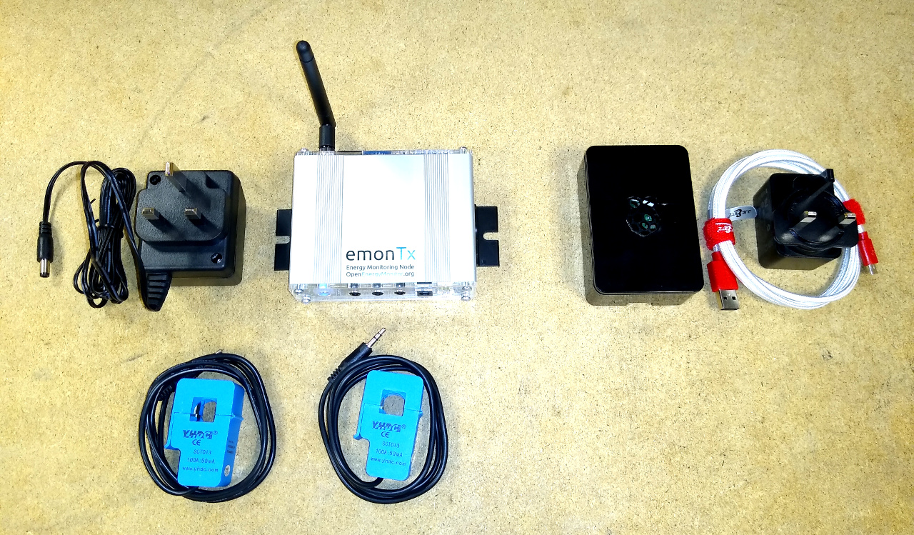
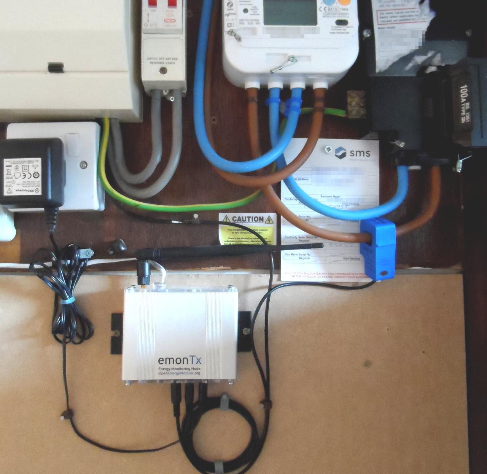
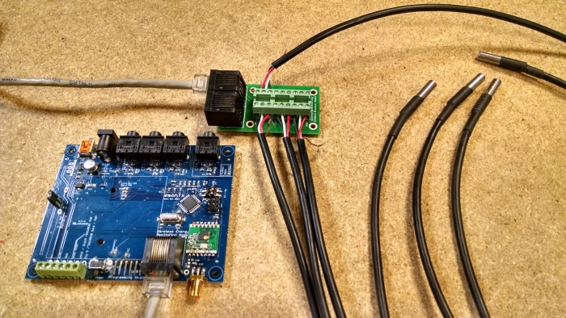
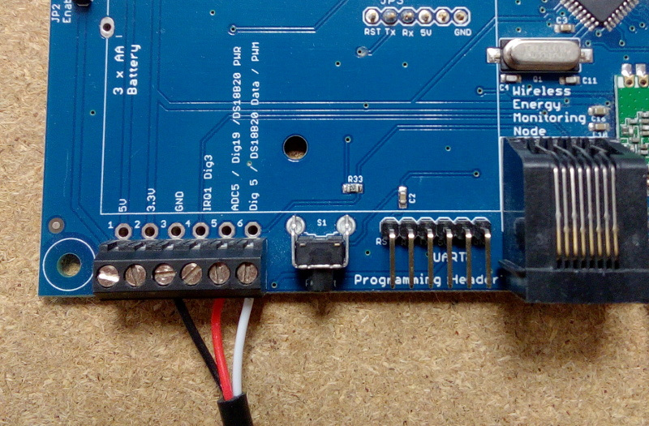
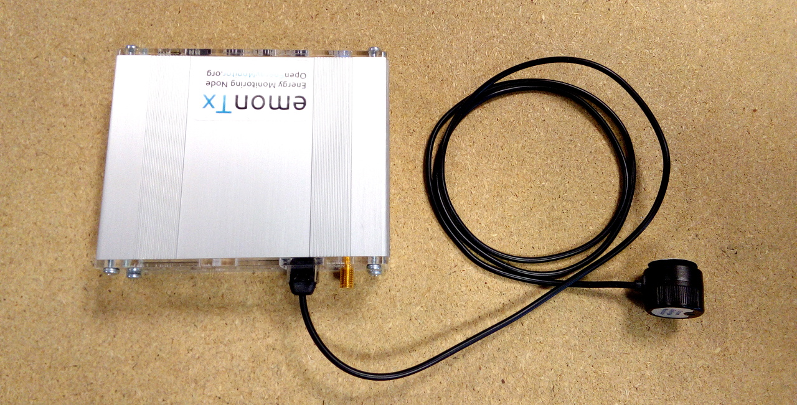
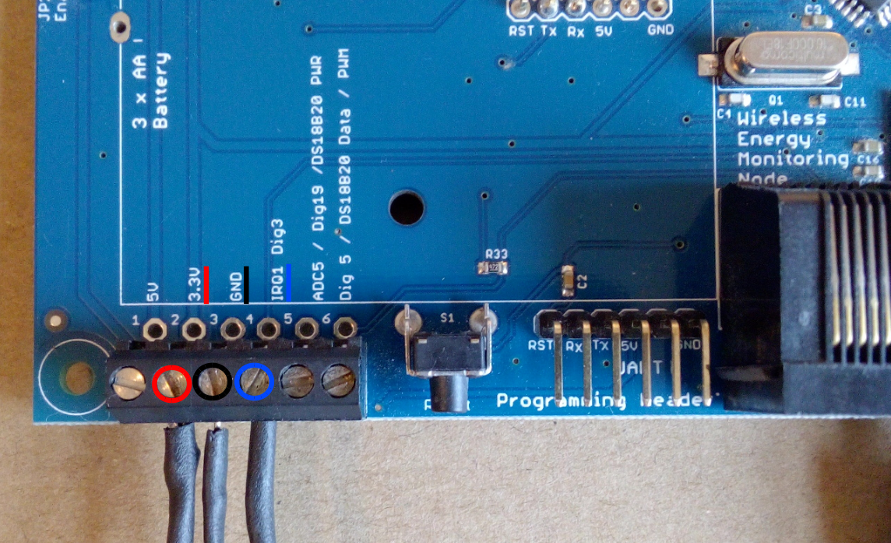

# emonTx3 Install Guide

The following guide details how to install an [emonTx3 energy monitoring node](overview.md). Covering an example with 2x CT sensors to monitor two AC circuits in a house and an ACAC Voltage sensor to allow real power calculation as well as power for the emonTx unit itself. The emonTx supports up to 4x CT sensors so the steps below can easily be extended to monitor additional circuits. 

In this example the emonTx transmits AC power, voltage and temperature sensor measurements (if connected) every 10s via 433 MHz radio to the emonBase base-station. 

The emonBase base-station consists of a RaspberryPi and an RFM69Pi adapter board to receive the 433 MHz radio packets from the emonTx. The emonBase runs our emonSD software including emonCMS for full local data logging and visualisation capability.

- New 2019: The emonTx firmware now supports higher accuracy continuous monitoring as standard, power from an ACAC adapter or USB power is assumed.
- Alternative firmware options include: Discrete Sampling firmware - useful when only battery power is available; and 3-phase firmware.

A typical emonTx & emonBase system consists of:

- 1x [emonTx (includes antennae and wall mounts)](https://shop.openenergymonitor.com/emontx-v3-electricity-monitoring-transmitter/)
- 1-4x [100A CT sensors](https://shop.openenergymonitor.com/100a-max-clip-on-current-sensor-ct/)
- 1x [ACAC Voltage sensor](https://shop.openenergymonitor.com/ac-ac-power-supply-adapter-ac-voltage-sensor-uk-plug/)
- 1x [emonBase (RaspberryPi + RFM69Pi adapter board + Enclosure + emonSD card)](https://shop.openenergymonitor.com/emonbase-web-connected-base-station/)
- 1x [USB Power supply](https://shop.openenergymonitor.com/5v-dc-usb-power-adapter-uk-plug/) and [micro-USB cable](https://shop.openenergymonitor.com/micro-usb-cable-20-awg-emonbase/)

## Example emonTx sensor node installation

In this example installation the total house electricity consumption is measured using the CT sensor attached to the brown cable (main feed to the house). Another CT sensor is located inside the main consumer unit, in this case monitoring the electricity supply to a heat pump.

A dedicated socket was installed for the AC-AC Voltage sensor and combined power supply. 

A RFM69 433 MHz antennae is attached and also a DS18B20 temperature sensor connected to the emonTx RJ45 Temperature and Pulse input socket.

The emonTx transmits real power, cumulative watt-hours, mains voltage and temperature measurements every 10s over RFM69 radio to an emonBase connected via Ethernet to the internet router in the living room.

## Installation overview

**emonTx**

1. Mount emonTx in desired location, use wall mounts if required, attach antennae.
2. Plug CT sensors into the emonTx first and then clip around either the **Line** or **Neutral** cable of the AC circuits that you wish to measure. If the power reading is negative, reverse the CT sensor orientation. [Please read the CT installation guide before installing](electricity-monitoring/ct-sensors/installation.md).
3. Attach temperature sensors or/and pulse sensor as required. See guides: [+ Add Temperature Nodes](/setup/emonth) and [+ Add Optical Pulse Sensor](/setup/optical-pulse-sensor).
    
3. Plug in and connect the AC-AC adapter to provide voltage measurement and power. This may require installation of a new outlet or extending an existing one.

**emonBase**

1. Connect Ethernet before powering up the emonBase if using Ethernet.
2. Plug in USB power supply and connect micro-USB cable.

That's the hardware setup done! The next step is to configure the network connection and setup the emonBase to log data locally or/and post data to a remote server such as emoncms.org. 

To setup the software continue to guides: 

- [1. Connect](/setup/connect)
- [2. Log Locally](/setup/local)
- [3. Log Remotely](/setup/remote)

For advanced emonTx configuration and alternative firmware options see:  [emonTx technical guide](/technical/emontx).

## Temperature sensing

- [Shop: Encapsulated DS18B20 temperature sensor](http://shop.openenergymonitor.com/encapsulated-ds18b20-temperature-sensor/)
- [Shop: emonPi / emonTx RJ45 to Terminal Block Breakout for DS18B20](https://shop.openenergymonitor.com/rj45-to-terminal-block-breakout-for-ds18b20/)

**EmonTx Power Supply** 
When using multiple temperature sensors and or an optical pulse sensor with the emonTx it is recommended to power the emonTx via a 5V USB rather than AC-AC adapter due to increased power requirement. An AC-AC adapter can still be used to provide an AC voltage reference. 

**EmonTx Low power battery mode** 
In order to save power when running on batteries, the emonTx V3 supports switching off of the DS18B20 in-between readings and performing the temperature conversion while the ATmega328 is sleeping. To do this, power (3.3 V) is supplied to the DS18B20's power pin from Dig19 (ADC5), this digital pin is switched off between readings. (This facility is available only if the temperature sensors are connected via the terminal block.) The data connection from the DS18B20 is connected to Dig5, this I/O pin has a 4K7 pull-up resistor on-board as required by the DS18B20. 

**RJ45 Pinout** 
The RJ45 implements a standard pinout used by other manufacturers of DS18B20 temperate sensing hardware such as Sheepwalk Electronics.

*Note: The RJ45 socket does not support power supply switching via Dig19 (ADC5) as described above.*

**Terminal Block Connection** 
To connect an external DS18B20 to the emonTx V3 screw terminal block, connect the **black** wire to GND, **red** to 'ADC5 / Dig19 / DS18B20 PWR' and **white** to 'Dig 5 / DS18B20 Data / PWM':

**Further reading** 
If you are using temperature sensors with heating systems such as heat pumps the following blog post by John Cantor provides a number of useful mounting suggestions: [John Cantor's Blog: Temperature sensors for monitoring heat pumps](https://heatpumps.co.uk/2015/06/08/temperature-sensing-with-openenergymonitor)

## Pulse counting

The emonTx supports the OpenEnergyMonitor optical pulse counter. The optical pulse counter plugs into the RJ45 socket on the EmonTx.

Alternatively the terminal block can be used for wired pulse counting. Connect the pulse output to **IRQ1 Dig3** (4th along from left). 

If you are using an optical counter attached to the terminal block, connect the power pin to the 3.3V terminal or 5V if the emonTx is powered via USB (2nd or 1st from the left) and connect ground to GND (3rd from the left).

For isolated volt-free / switch output (SO) pulse output devices, connect across IRQ1 Dig3 and GND. There is an internal pull-up resistor on the pulse input that is enabled in the standard firmware that will pull the signal up when the switched output is open.

In the face of long leads and/or moderate interference, it is advisable to “stiffen” the relatively weak internal pull-up with a parallel 10 kΩ (or possibly less if necessary) resistor wired between the pulse input and the 3.3 V supply.

Alternatively a volt-free / switch output (SO) pulse output device can be connected across 3.3V (or 5V) and IRQ1 Dig3. A pull-down resistor of resistance low enough to overcome the internal pull-up resistor needs to be added in this case, or a higher-value resistor with the firmware modified to disable the internal pull-up.

We recommend powering the emonTx v3 from either a 5V USB or AC-AC adaptor when used for pulse counting operation. Due to the additional power requirements of the optical pulse sensor, battery life will be reduced significantly compared to an emonTx powered by 3 AA batteries for CT operation only. 
