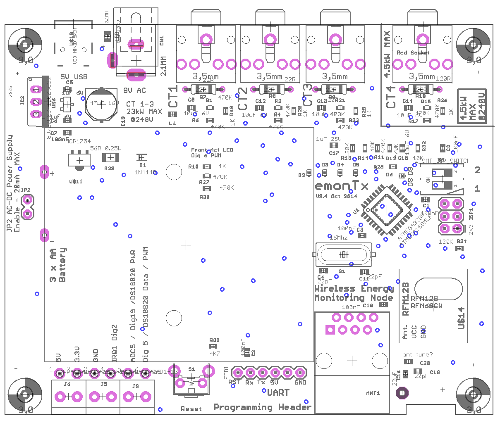

# emonTx Technical Overview

The emonTx is an low power RF remote sensor node. Data is transmitted to an emonPi or an emonBase via a low power 433 MHz radio. This page provides a technical overview of the emonTx including configuration & firmware. For installation instructions see Hardware Setup guides.


**Features:**

- 4x CT Sensor inputs for single-phase AC electricity monitoring designed for use with the [100A SCT-013-000 CT sensor](https://shop.openenergymonitor.com/100a-max-clip-on-current-sensor-ct/)
- CT 1-3 are standard 100A / 24KW max CT inputs (@240V)
- CT 4 is a special high sensitivity input for 19A / 4.6KW (@240V)
- 1x AC voltage measurement using plug-in AC-AC adapter for real power calculation alongside current measurement from CT sensors. Designed for use with a [9V AC output voltage adapter](https://shop.openenergymonitor.com/ac-ac-power-supply-adapter-ac-voltage-sensor-uk-plug/)
- Support for multiple wired one-wire DS18B20 temperature sensors via RJ45 socket or terminal block.
- Support for pulse counting either wired or via Optical Pulse Sensor
- Can be powered by a single AC-AC adaptor (DC PSU not required)
- Battery power option via 3 x AA batteries
- RF Range is approximately similar to home WiFi (real world range depends on many factors e.g. thick stone walls)
- Up to 2x emonTx can be connected to a single emonPi or emonBase (up to 30x is possible with manual RF node ID setting*)
- Wall-mount option
- New 2019: The emonTx firmware now supports higher accuracy continuous monitoring as standard, power from an ACAC adapter or USB power is assumed.
- Alternative firmware options include: Discrete Sampling firmware - useful when only battery power is available; and 3-phase firmware.

**WiFi option:** It is possible to use an emonTx with a ESP8266 WiFi adapter to provide WiFi connectivity. This can be useful in applications where the 433 MHz radio range is not sufficient but there is good WiFi signal. The emonTx can post data to a local emonBase/emonPi over WiFi or work in 'standalone mode' to post directly to a remote emoncms server such as emoncms.org. See [Using emonTx with the ESP8266 WiFi module](esp8266.md)

**Battery vs AC adapter:**
An emonTx can be powered by 3 x AA batteries; however, if possible, it is recommended to power the unit with an AC-AC adapter to provide an AC voltage reference for more accurate real power calculation and continuous sampling support.

## Configuration

**Configure RF Node ID and Voltage calibration**<br>
Multiple emonTx unit's can operate on a single network posting to a single emonBase web-connected base station, each emonTx on the same network group must have an unique node ID. The nodeID can be selected at time of purchase or set using the on-board DIP switch to toggle. If more than two emonTx's are required on the same network then further nodeID values can be set via RF node ID serial config.


```{image} img/emontx_dipswitch.jpg
:width: 400px
:align: right
```

The image on the right shows the DIP switch configuration looking at the emonTx with the CT sensor inputs at the top of the board. Move the top switch D9 to the left to select USA ACAC Voltage calibration. **Move the bottom switch D8 to the left to select RF node ID 16 rather than 15.**

**Serial Configuration**<br>
It's possible to set the emonTx radio settings, sensor calibration and other properties over serial. See [Github PDF: Configuration of RF Module & on-line calibration](https://github.com/openenergymonitor/EmonTxV3CM/blob/master/Config.pdf) for full details. If a custom node ID is set, a corresponding node decoder needs to be in place in emonhub.conf to decode the EmonTx radio packet data. See [emonhub.conf configuration guide](https://github.com/openenergymonitor/emonhub/blob/emon-pi/configuration.md).

## Power Supply Options

There are four ways to power the emonTx3:

1. USB to UART cable - only recommended for short periods while programming, it is recommended to remove all other power sources
2. 5V DC Mini-USB cable - remove jumper JP2 when powering via DC if AC adapter is present
3. 3 x AA Batteries - remove jumper JP2 when powering via DC if AC adapter is present
4. 9V AC-AC power adapter - with jumper JP2 closed (If jumper 2 is left open then the AC-AC adapter will be used for power sampling but not to power the emonTx3 - see AC adapter voltage sensing and power supply below).

## AC adapter voltage sensing and power supply.

The emonTx3 is designed to use an AC-AC adapter to provide an AC voltage sample and also depending on the configuration power as well. If the emonTx3 detects the presence of an AC adapter at startup, it will automatically implement Real Power and Vrms measurements by sampling the AC voltage. Real Power is what you get billed for, and depending on the appliances connected to the circuit being monitored, can vary significantly from Apparent Power - see Learn for more info on AC power theory. **For best energy monitoring accuracy, we recommend powering the emonTx3 with an AC-AC adapter whenever possible**.

Using the AC-AC adapter also enables the emonTx to monitor the direction of current flow. This is important for solar PV monitoring. If you notice a negative reading when you were expecting a positive one, reverse the orientation of the CT on the conductor.

Powering via the AC adapter is only suitable for standard CT monitoring and up to 4x DS18B20 temperature sensors, transmitting data via RFM69 433Mhz radio. The power supply circuit is only able to deliver a limited amount of current without impacting the voltage sensor accuracy.

To avoid damage to the emonTx3 circuits, the current drawn from the AC circuit should never exceed 60mA. If more than 10 mA of current is required, it is recommended to remove jumper 2 (JP2) and power the emonTx via the 5V mini-USB connector. When JP2 is removed, the AC-AC adapter (if connected) will be used only to provide an AC voltage sample, i.e. it will not power the emonTx.

**If using the emonTx with an ESP8266 WiFi adapter a seperate 5V USB power supply is required.**

## Schematic and Board files

**emonTx Schematic and Board files:**<br> [https://github.com/openenergymonitor/emontx3/tree/master/hardware](https://github.com/openenergymonitor/emontx3/tree/master/hardware)

**emonTx Wiki:**<br> [https://wiki.openenergymonitor.org/index.php/EmonTx_V3.4](https://wiki.openenergymonitor.org/index.php/EmonTx_V3.4)

## Port Map




*Note: The FTDI connector Tx and Rx pins are reversed on the PCB legend and on the Schematic. Data is received by the emonTx on the Tx pin and transmitted by the emonTx on the Rx pin.*
