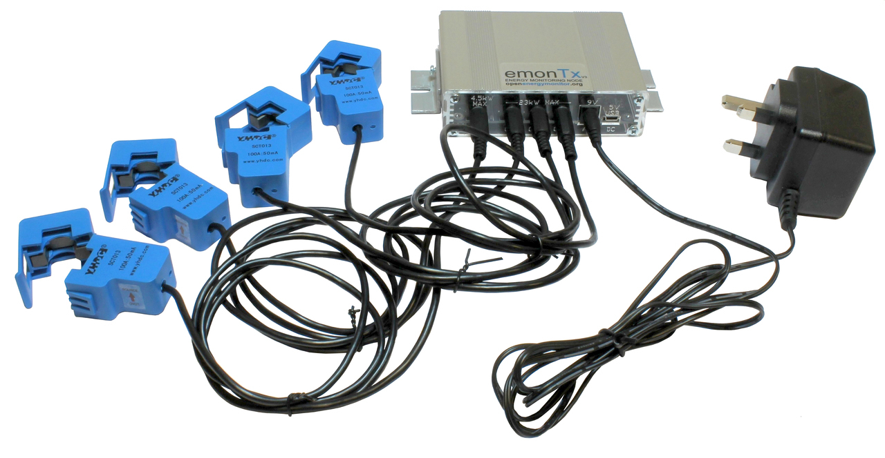

# emonTx Technical Overview

The emonTx is an low power RF remote sensor node. Data is transmitted to an emonPi or an emonBase via a low power 433 MHz radio. This page provides a technical overview of the emonTx including configuration & firmware. For installation instructions see Hardware Setup guides.



**Features:**

- 4x CT Sensor inputs for single-phase AC electricity monitoring designed for use with the [100A SCT-013-000 CT sensor](https://shop.openenergymonitor.com/100a-max-clip-on-current-sensor-ct/)
- CT 1-3 are standard 100A / 24KW max CT inputs (@240V)
- CT 4 is a special high sensitivity input for 19A / 4.6KW (@240V)
- 1x AC voltage measurement using plug-in AC-AC adapter for real power calculation alongside current measurement from CT sensors. Designed for use with a [9V AC output voltage adapter](https://shop.openenergymonitor.com/ac-ac-power-supply-adapter-ac-voltage-sensor-uk-plug/)
- Support for multiple wired one-wire DS18B20 temperature sensors via RJ45 socket or terminal block.
- Support for pulse counting either wired or via Optical Pulse Sensor
- Can be powered by a single AC-AC adaptor (DC PSU not required)
- Battery power option via 3 x AA batteries
- RF Range is approximately similar to home WiFi (real world range depends on many factors e.g. thick stone walls)
- Up to 2x emonTx can be connected to a single emonPi or emonBase (up to 30x is possible with manual RF node ID setting*)
- Wall-mount option
- New 2019: The emonTx firmware now supports higher accuracy continuous monitoring as standard, power from an ACAC adapter or USB power is assumed.
- Alternative firmware options include: Discrete Sampling firmware - useful when only battery power is available; and 3-phase firmware.

**WiFi option:** It is possible to use an emonTx with a ESP8266 WiFi adapter to provide WiFi connectivity. This can be useful in applications where the 433 MHz radio range is not sufficient but there is good WiFi signal. The emonTx can post data to a local emonBase/emonPi over WiFi or work in 'standalone mode' to post directly to a remote emoncms server such as emoncms.org. See [Using emonTx with the ESP8266 WiFi module](esp8266.md)

**Battery vs AC adapter:**
An emonTx can be powered by 3 x AA batteries; however, if possible, it is recommended to power the unit with an AC-AC adapter to provide an AC voltage reference for more accurate real power calculation and continuous sampling support.

## Configuration

**Configure RF Node ID and Voltage calibration**<br>
Multiple emonTx unit's can operate on a single network posting to a single emonBase web-connected base station, each emonTx on the same network group must have an unique node ID. The nodeID can be selected at time of purchase or set using the on-board DIP switch to toggle. If more than two emonTx's are required on the same network then further nodeID values can be set via RF node ID serial config.


```{image} img/emontx_dipswitch.jpg
:width: 400px
:align: right
```

The image on the right shows the DIP switch configuration looking at the emonTx with the CT sensor inputs at the top of the board. Move the top switch D9 to the left to select USA ACAC Voltage calibration. **Move the bottom switch D8 to the left to select RF node ID 16 rather than 15.**

**Serial Configuration**<br>
It's possible to set the emonTx radio settings, sensor calibration and other properties over serial. See [Github PDF: Configuration of RF Module & on-line calibration](https://github.com/openenergymonitor/EmonTxV3CM/blob/master/Config.pdf) for full details. If a custom node ID is set, a corresponding node decoder needs to be in place in emonhub.conf to decode the EmonTx radio packet data. See [emonhub.conf configuration guide](https://github.com/openenergymonitor/emonhub/blob/emon-pi/configuration.md).

**Powering via 5V USB**<br>
If using the emonTx with an ESP8266 WiFi adapter a 5V USB power supply is required in addition to the AC Voltage adapter used for voltage sensing. It is advisable to remove jumper JP2 to the left of the battery compartment if both are present (looking at the emonTx with the CT sensor inputs at the top of the board).

## Firmware

The emonTx firmware is based on Arduino. Alternative or customised firmware sketches can be uploaded using Arduino IDE or PlatformIO and a USB to UART cable. The emonTx comes pre-loaded with the emonTxV3CM Continuous Sampling firmware as standard for single phase operation. If you bought the emonTx with the battery holder option it will come with the Discreet Sampling firmware.

### [emonTxV3CM Continuous Sampling firmware](https://github.com/openenergymonitor/EmonTxV3CM)

New 2019: This firmware provides higher accuracy continuous monitoring and is now installed on emonTx units as standard. Continuous monitoring means that the power readings are representative of the full 10s period that they represent rather than a short snapshot.

### [emonTx Discreet Sampling firmware](https://github.com/openenergymonitor/emontx3/tree/master/firmware)

The original emonTx firmware, this performs power measurement in short discreet snapshots ~300ms long per CT channel at 50Hz per 10s period. This makes it possible for the emonTx to go to sleep inbetween readings enabling battery powered operation but is less accurate.<br>

**Indicator LED:** Illuminates solid for a 10 seconds on first power up, then flashes multiple times to indicate an AC-AC waveform has been detected (if powering via AC-AC adapter). Flashes once every 10s to indicate sampling and RF transmission interval.

### [3-phase firmware](https://github.com/openenergymonitor/emontx-3phase)

This firmware is intended for use on a 3-phase, 4-wire system and implements continuous monitoring as above. Because the voltage of only one phase can be measured, the firmware must assume that the voltages of the other two phases are the same. This will, in most cases, not be true, therefore the powers calculated and recorded will be inaccurate. However, this error should normally be limited to a few percent.

- [Learn: Introduction to three-phase](https://learn.openenergymonitor.org/electricity-monitoring/ac-power-theory/3-phase-power)
- [3-phase Firmware](https://github.com/openenergymonitor/emontx-3phase) 
- [Full 3-phase Firmware User Guide](https://github.com/openenergymonitor/emontx-3phase/blob/master/emontx-3-phase-userguide.pdf)

### Schematic and Board files

**emonTx Schematic and Board files:**<br> [https://github.com/openenergymonitor/emontx3/tree/master/hardware](https://github.com/openenergymonitor/emontx3/tree/master/hardware)

**emonTx Wiki:**<br> [https://wiki.openenergymonitor.org/index.php/EmonTx_V3.4](https://wiki.openenergymonitor.org/index.php/EmonTx_V3.4)
