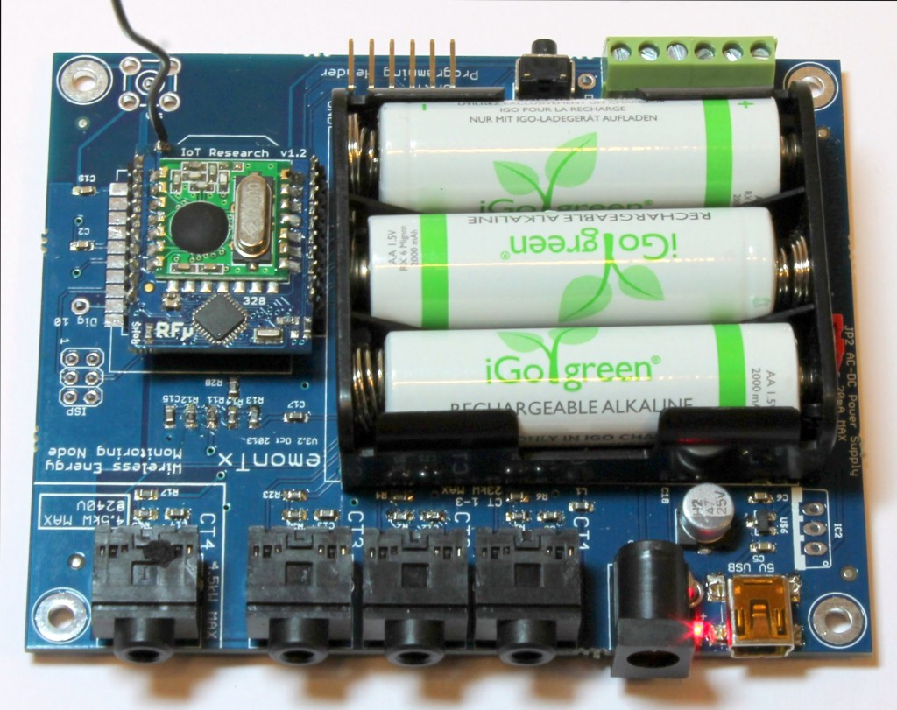
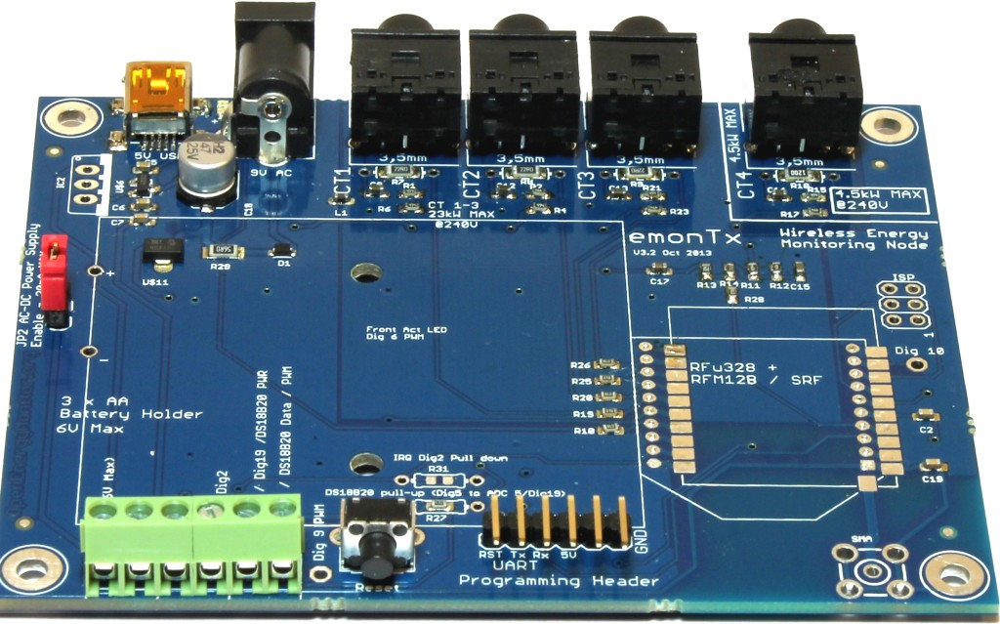
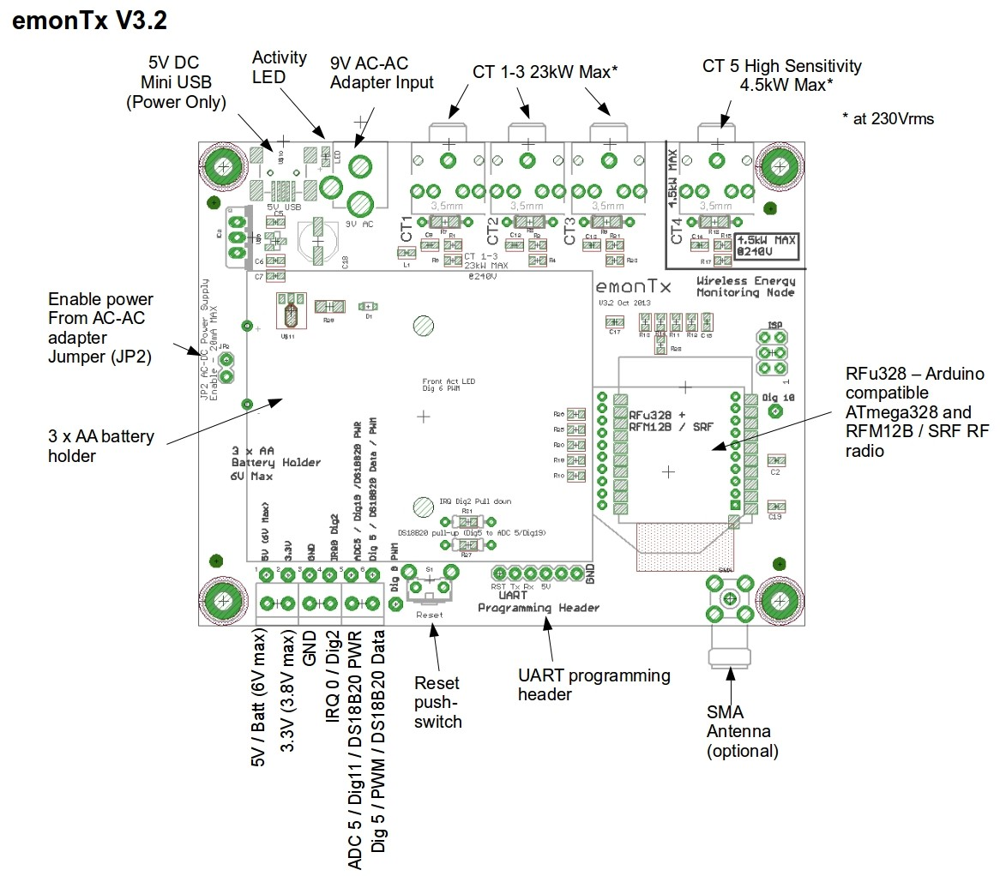
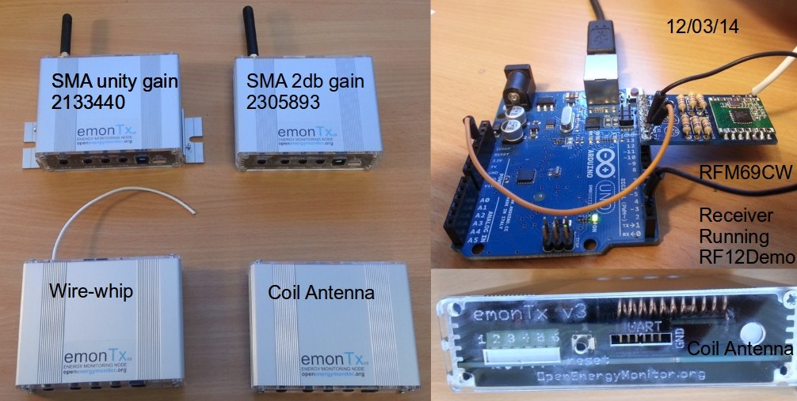
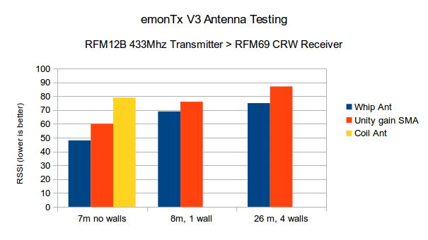
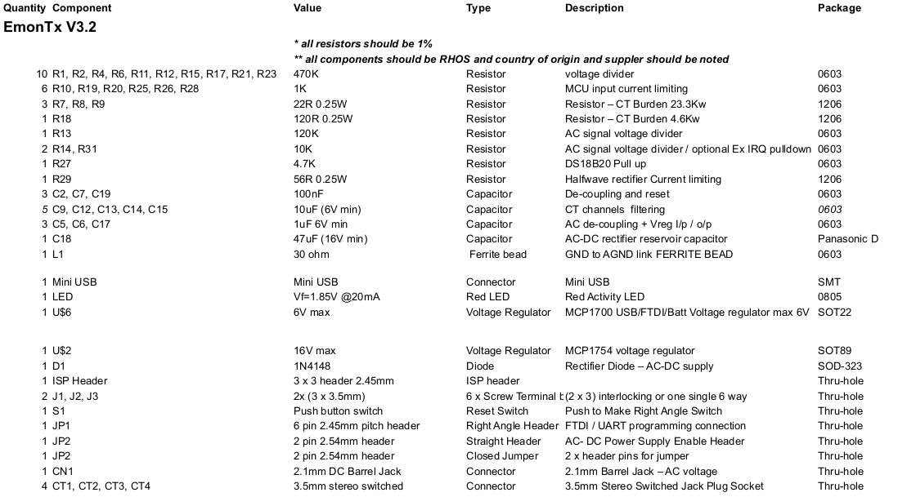

# emonTx 3.2.x

The emonTx v3.2 used the RFu328 module to provide both the ATmega328 and the RFM12B radio module. This was available pre-installed or the emonTx base board. 

## Port Map

*Note: pulse counting on IRQ0, Dig2 rather than IRQ1 Dig3 on the emonTx3.4 

## Firmware

See: [https://github.com/openenergymonitor/emonTxFirmware/tree/master/emonTxV3/RFM/emonTxV3.2 ](https://github.com/openenergymonitor/emonTxFirmware/tree/master/emonTxV3/RFM/emonTxV3.2 )

## RF Connectivity

### RFM12B

To use the RFM12B on the RFu328, a modified version of the JeeLib RF12 library has been created. This is called the [RFu_JeeLib](https://github.com/openenergymonitor/RFu_jeelib) see the GitHub readme for details regarding the modifications. 

The emonTx V3.2 was initially shipped with a wire whip antenna. An SMA antenna could alternatively be added by soldering in the connector on the board. A small wire link was required between the RFu328 and the base board if an RFu328 with headers was used. See [EmonTx_V3_SMA.jpg](img/EmonTx_V3_SMA.jpg) & [EmonTx_V3_SMA_RFu_headers.jpg](img/EmonTx_V3_SMA_RFu_headers.jpg).

Power consumption:

- MCU sleep + RFM12B sleep: 0.034 mA
- MCU running: 7.3mA 
- MCU + LED: 9-10mA
- RFM12B TX ~3ms: 23-28mA

### RF testing

All antennas and RFM12B modules were 433MHz running standard emonTx discrete sampling firmware, transmitting once very 10s.

An RFM69CW receiver provided RSSI readings to enable antenna comparison. The RSSI readings were all lower than normal since the RFM69CW used is an 868MHz module, with an 868MHz antenna, forced via software, to a 433MHz receive frequency.

The emonTxs with the SMA antenna had the RFu328 soldered directly (SMT) to the PCB, the coil and whip antenna had the RFu328 mounted using headers 

## BOM

## Dimensions

Enclosure: extruded aluminium case with acrylic fascia.

**DIN Rail Mount:** Thanks to [@Aquefot](http://twitter.ccom/Aquefot) for contributing a [DIN mount rail fitting CAD design](https://twitter.com/aquefot/status/413708371809026048/photo/1) ready to be 3D printed for the emonTx: [Thingiverse Download](http://www.thingiverse.com/thing:208177) 

## Licence

Creative Commons Attribution-ShareAlike 3.0 Unported License
